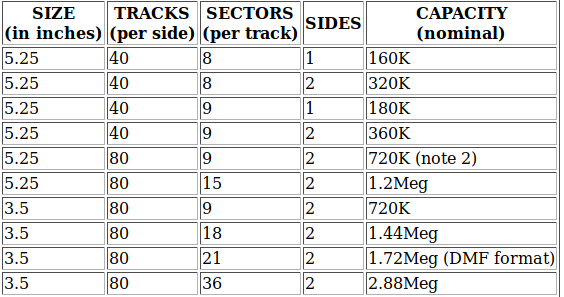
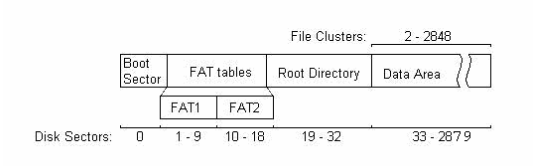
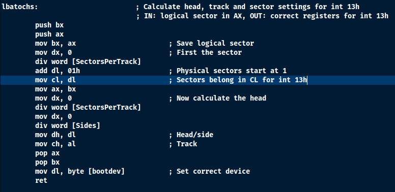
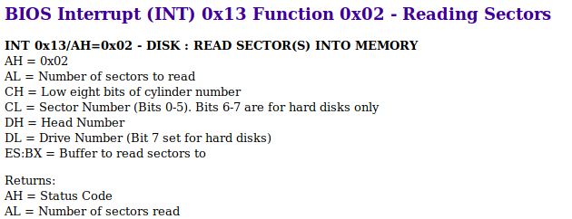

# MINIMAL-OS

# 8086 MICROPROCESSOR

* 8086 Microprocessor is an enhanced version of 8085Microprocessor that was designed by Intel in 1976. 
* It is a 16-bit Microprocessor having 20 address lines and16 data lines that provides up to 1MB storage. 
* It consists of powerful instruction set, which provides operations like multiplication and division easily.

# REAL VS PROTECTED MODE

## PROTECTED MODE
* Protected Mode was primarily designed to increase the stabaility of the systems.
* Has Memory Protection
* Has hardware support for Virtual Memory and Task State Switching (TSS)
* Hardware support for interruting programs and executing another
* Access to 32 bit registers
* Access to up to 4 GB of memory
* The unfortanate truth is that in protected mode, there is no interrupts. No interrupts, No System calls, No Standard Library .
* Everything we do, we have to do ourselves from scratch.

## REAL MODE
* the x86 processor boots into a 16 bit environment
* The bootloader always start from this mode.
* Uses the native segment:offset memory model.
* Is limited to 1 MB (+64k) of memory.
* No Virtual Memory or Memory Protection.
* There is no memory segmentation. Anything can be popped out anywhere.
* There are no process boundaries.
* At real mode, it becomes the responsibility of the bootloader code to enforce process boundaries to avoid overlapping.

# x86 MEMORY SEGMENTAION

* As we are building a 16 bit bootloader that means our bootloader can execute upto 16 bit instructions. Therefore the size of the segment can range from 1 byte upto 65536 bytes.

* The 16-bit segment selector in the segment register is interpreted as the most significant 16 bits of a linear 20 bit address called segment address.

* And remaining 4 bits are all zeroes. 

* The segment address(16 bits) is always added to the 16 bits of offset to yield 20 bits of linear address.
For doing this the 16 bits of segamnt address is shifted left by 4 bits and then offset is added to it.

* real mode can  be imagined as having a variable length for each segment, in the range 1 to 65,536 bytes, that is just not enforced by the CPU. But this can cause issue of process overlapping.

* A 16 bit of offset can create upto 64 KB of segment. And it can go no larger than that.

* Because there is no protection or privilege limitation in real mode, even if a segment could be defined to be smaller than 64 KB, it would still be entirely up to the programs to coordinate and keep within the bounds of their segments, as any program can always access any memory

* Each segment begins at a multiple of 16 bytes, called a paragraph, from the beginning of the linear (flat) address space

# FLOPPY ARCHITECTURE

# FAT 12 FILE SYSTEM

* The File Allocation Table (FAT) is a table stored on a hard disk or floppy disk that indicates the
status and location of all data clusters that are on the disk. The File Allocation Table can be
considered to be the "table of contents" of a disk. If the file allocation table is damaged or lost, then a
disk is unreadable.  

* The number “12” is derived from the fact that the FAT consists of 12-bit entries. 

* The storage space on a floppy disk is divided into units called sectors. In larger storage devices, a
bunch of sectors form a cluster. However, for the floppy disk, the number of sectors in a cluster is
one. Also, the size of a sector (and hence a cluster) is 512 bytes for a floppy disk

# DISK ORGANIZATION
* The boot sector consists of the first sector (sector 0) on the disk. The boot sector contains the information about the rest of the organization of file system.

* FAT tables contain pointers to every cluster on the disk, and indicate the number of the next
cluster in the current cluster chain, the end of the cluster chain, whether a cluster is empty, or
has errors. The FAT tables are the only method of finding the location of files and directories
on the rest of the disk. There are typically two redundant copies of the FAT table on disk for
data security and recovery purposes. On a floppy, since a cluster consists of just one sector,
there is a FAT entry pointer to every sector on the disk.

* The root directory is the primary directory of the disk. Unlike other directories located in the
data area of the disk, the root directory has a finite size (For FAT12, 14 sectors * 16 directory entries per sector = 224 possible entries), restricting the total amount of files or directories that
can be created therein.

* Data Area. - The first sector or cluster of the data area corresponds to cluster 2 of the file
system (the first cluster is always cluster 2). The data area contains file and directory data and
spans the remaining sectors on the disk.

# THE BOOT SECTOR

* The boot sector exists at sector 0 on the disk and contains the basic disk geometry, which is the set of
information needed by the operating system to use the disk correctly. Whenever the disk is used, the
information from the boot sector is read and any needed information is extracted from it.

# FAT(FILE ALLOCATION TABLE) 

* The FAT is a data structure that maps the data sectors. Each entry in the FAT corresponds to a cluster of data on the disk. The values in each entry of the FAT that are of interest are:

 * A value signifying that this data cluster is the last cluster of a file
 * A value signifying that this data cluster is currently unused
 * A value signifying where the NEXT data cluster of the current file is located.
 
## TRANSLATION FROM PHYSICAL TO LOGICAL DATA SECTOR NUMBER (VVIMP)

* From the organization of the disk, it is seen that the first 33 sectors are predefined. The actual
data sector that holds user data does not exist in these first 33 sectors and starts at sector
number 33 (remember we start with 0).
* The entries in positions 0 and 1 of the FAT are reserved. Therefore, it is entry 2 of the FAT
that actually contains the description for physical sector number 33.
* Therefore, physical sector number = 33 + FAT entry number - 2

# DIRECTORIES

Each directory entry contains the following information about the file or subdirectory to which it
points.  

# FLOPPY ANALYSIS
## DEVICE USED: VIRTUAL FLOPPY
## SOFTWARE USED: DEBUG
We have used debug to visualize the boot sector of the floppy.
Load at offset 0  from drive 0 from starting sector 0 of the disk and bring in 1 sector 
L0 0 0 1
On running above command the debug will load the first sector of floppy disk which is of 512 Bytes in our memory at offset 0.
D0
On running above command we will get the dump of the first sector that has been loaded at offset zero.
 
## ANALYZING THE BOOT SECTOR CONTENTS OF MEMORY

* The first 10 bytes of boot sector is machine language code.

* The first 3 bytes from offset 0 contains a jump statement, where to jump to actual bootstrap code.

* The next from 3rd byte to the 11th byte is nothing but the OEM label. This portion is not executed because it's the data which is being used below in the bootstrap code.

* The next two bytes after the first 11 bytes i.e from 11th byte to 13th byte from the starting offset is the bytes per sector field. (Values are stored in little endian format i.e 00 02 actually is 02 00 which is 512 in decimal.

* Next 1 byte i.e is th 14th byte from offset is number of sectors per cluster. 

* Next 2 bytes i.e 15th and 16th byte from the starting offset is number of relative sectors. The relative sector is number of sector that follow the boot sector but come before the fat12 table (including the first sector of fat). So as we can see, its value is one. That means, there is no sector between bootsector and fat table.

* Next byte i.e 17th byte holds the value of number of FAT12 table. Here the value is 2, therefore there are 2 fat12 tables.

* Next 2 bytes (18th and 19th bytes) are number of root directory entries. Here the value is E0 00 which is in little endian. Therefore the actual value is 00 E0 which is 224. Therefore there are 224 root directory entries.

* Next 2 bytes (20th and 21th bytes) is total no of sectors on the drive. Here the value is 40 0B which is in little endian. The actual value is 0B40, whih in decimal is 2880.

* The next 1 byte (22nd byte) is the media descriptor byte. This byte describes the media. If we are looking in floppy disk the file descriptor value would be F0.

* The next 2 bytes (23rd and 24th byte) represents number of sectors that make up the file allocation table. Here the value is 0900 which is in little endian. That means the actual value is 00 09, which is 9 in decimal. Each file allocation table will take 9 sectors in disk.

* The next 2 bytes (25th and 26th byte) represents number of sectors per track. Here the value is  12 00. Therefore the actual value is 0012, it is 18 in decimal.

* The next 2 bytes (27th and 28th byte) represents number of heads. Here the value is  02 00. Therefore the actual value is 0002, it is 2 in decimal.

* The next 4 bytes (29th ,30th ,31st ,32nd byte) are all zeroes. It is number of hidden sectors.

* The next 4 bytes (33rd, 34th. 35th, 36th) are all zeroes.

* The physical drive number, is the next byte (37th byte) which is 00.

* The next byte (38th byte) is 0, which represents current head.

* The next one byte (39th byte) is the boot signature. Here the value is 29.

* The next 4 byte (40th, 41st, 42nd, 43rd byte) is a 32 bit volume id. This value changes on each format.

* The next 11 bytes ( 44th ,45th ,46th ,47th ,48th ,49th ,50th, 51st, 52nd, 53rd, 54th byte), have ' no name'. 
That were volume lable would go but now it goes in root directory table. So that is why it contains no name.

* The next 8 bytes ( 55,56,57,58,59,60,61,62nd byte) represents type of file system.

* And from 63rd byte the bootstrap code starts.

# CODE EXPLANATION
## Data Initialization

*  On the basis of the analysis of the first sector of the floppy disk. We came to  know that the first 3 bytes are meant for the jump statement, that basically jumps to our bootstrap subroutine.
*  And rest till 61st byte tell about the disk organization.

## begin_bootloader

*  If the disk is bootable, then the boot sector will be loaded at 0x7C00, and INT 0x19 will jump to it, thereby giving control to the bootloader.

* In this sub routine the main aim is to create a size which can hold upto 512 bytes of bootloader and 8k of buffer, i.e 512 + 8192/16 = 544 paragraphs.

* 544 paragraphs means that we have to go across 544 segments of 16 byte each.

* The general purpose registers like AX do not point to the memory directly. Those are the segment register that point to memory. So it is upto segment registers to left shift the 16 bit data to refer to the main memory.

* At at last the 4k stack space is created.

## drive_check

* Drive check subroutine deals with initializing the parameters for INT 13H interrupt. The parametes are intialized to read 14 sectors of the root directory.

* One important point to be noted in this subroutine is that we are using LBA (logical block addressing) that has to be converted to CHS( Cylinder, head,sector) when trying to access floppy.

* In this subroutine the other thing that has been performed is to point he buffer using ES:BX register.

* INT 13h Interuupt takes parameter AH= 02 to perform reading and AL register provides with the value of number of sectors to read i.e 14.

* And by default, INT 13h writes the read data from the sectors into the buffer pointed by ES:BX. 

* For more information related INT 13h, do refer https://en.wikipedia.org/wiki/INT_13H

## read_14_sectors

* 'read_14_sectors', this subroutine now intiates the reading process.

## find_kernel

* 'find_kernel' subroutine will now look into the root directories. As we know there are 224 root directories.

* This subroutine won't traverse the directory now, it will just initialize certain parameters.

* Now we will point ES:DI to our buffer to perform string operations.

* And we will initialize CX (counter) to 224 before starting the loop.
 
 ## find_kernel_file

* 'find_kernel_file': is the subroutine at which the searching of the kernel file takes place. Aim is to find the root entry for the kernel file.

* each root entry size is 32 bytes long.

* There would be 2 loops that would be used in this case. First to traverse all 224 directories and other to compare the ES:DI to SI bytes to byte.

* Logic used for this purpose is explained in the code comments.

## kernel_file_found

* 'kernel_file_found': This subroutine is called when we successfully find the kernel file's root directory.

* Currently our EX:DI points to the root directory entry. From here the 11 + 15th offset value would give us the value of first logical cluster where the data of the kernel is present.

* We will fetch 2 bytes from that position.

* And now we have to prepare to again perform the read operation, to start reading the fat table.

* For reading again we have to use int 13h interrupt with AH value of 02 and Al value of 9. As fat table comprises of 9 sectors each.

* Even before that we would first convert the LBA 9 adress to to the CHS form.

## read_kernel

* 'read_kernel' is the subroutine where actual reading of the 9 sectors will take place. And all the read content would be directed to ES:BX, which points to buffer.

* One important point to note know is that, now  our buffer does not contain root directory, it contains the FAT table, first 9 sectors.

## read_fat_table

* 'read_fat_table' : this subroutine deals with traversing the fat table. And on the basis of the entry in FAT table we would fetch the cluster in data section and place it in some other buffer location.

* For that buffer location we had chosen ES:BX = 2000h:0

* We will read the data section cluster by cluster and store it in remote buffer.

## load_kernel_sector

* load_kernel_sector: This subroutine deals with reading the first logical cluster that we got from root directory entry.

* We will convert this to CHS form and using INT 13H Interrupt we will read the first sector into our new buffer.

* after loading the first sector into the buffer we have to load next cluster until the cluster chain ends.

* To accomplish this task we will use File Allocation Table that has been loaded in our previous buffer.

## use_fat_table

* use_fat_table : In this subroutine we have to deals with lookinf over the fat table and fething the 12 bits that would correspond to the address of next cluster.

* here the issue that arises is that, a fat entryis of 12 bits. And we dont have ant data structure which can directly fetch 12 bits from the fat table.

* So rather than thinking of fetching 12 bits we will fetch the whole 16 bits. 

* Now as we have fetched 2 bytes, therefore we would also grab some part of next fat entry.

* So our aim is to get rid of this false bits.

* One thing that have to be kept in mind is that fat entry 0 and 1 are reserved.

* So we are going to use a clear mathematical concept, which would deal with this situation.

* suppose we want to access 31 st entry in fat, for that we will ot go for the actual 31st entry we would reach for 3*n/2, where n is the entry required.

* On reaching their the 3*n/2 entry in fat we would fetch the 2 bytes straight.

* Now if the value is odd we would shift right our 16 bits value.

* Else if n is even value we will mask the 4 most significant bits.

## continue_cluster_chain

* continue_cluster_chain: Once we get the 12 bit entry using even-odd rule given above, we will save that cluster entry and will increment our pointer to next 512 bytes.
* Again the same routine will be executed, the cluster would be laoded, then fat table would be searched.
* This will run in continous iteration until the end of the cluster chain is found.

## lbatochs

* This subroutine deals with converting the logical block address of sector in a form of a CHS address. CHS address represents logical address in a form of CYLINDER, HEAD and SECTOR.

* The main reason we would be doing it is for initiating the INT 13H Interrupt.

# CREATING SETUP
* Before working with all code. We need to setup the enviroment
* We have used the VMWARE for this project.
* We have used window XP 32 bit. You can choose any of the images, but do see the compatibility of NASM.exe and DEBUG.exe
* You would need a virtual floppy disk.For that you can refer to https://www.allbootdisks.com/download/95.html

# SCREENSHOTS OF IMPLEMENTATION
## For implementing the same following steps have to be reproduced!
* We would need a assembler that would be converting our assembly code to a object code (binary)
 * Install NASM and run following command 
   * nasm boot.asm -o boot.bin
   * nasm kernel.asm -o kernel.bin (Do same for kernel file)
* Write the boot sector code i.e boot.asm to the first sector of the Floppy disk using DEBUG
 * install debug and use following command
   * n boot.bin
   * 1 0
   * w 0 0 0 1
* Once the boot code has been written in the first sector. Now we will reboot our virtual machine to and boot it from the virtual disk.
* Here we will look over 2 scnarios
 * First when kernel.bin file is not present inside the floppy.
 * Second when we will keep the kernel.bin file inside the floppy.

#  ***You will observe the following results***

## Writing binaries to floppy

## When kernel.bin is not present inside floppy drive

## When kernel.bin is present inside floppy drive

# REFERENCES!!!
## This project has been research and learning based and meant for the those who want to gain insight to inner working of the booting process. The following links given below are of great help for code and conceptual parts.

* http://www.brokenthorn.com/Resources/
* http://mikeos.sourceforge.net/write-your-own-os.html
* https://youtu.be/cOCU1qug0Lo
* https://en.wikipedia.org/wiki/X86_memory_segmentation
* https://www.eit.lth.se/fileadmin/eit/courses/eitn50/Literature/fat12_description.pdf
* https://www.tutorialspoint.com/assembly_programming/assembly_registers.htm

